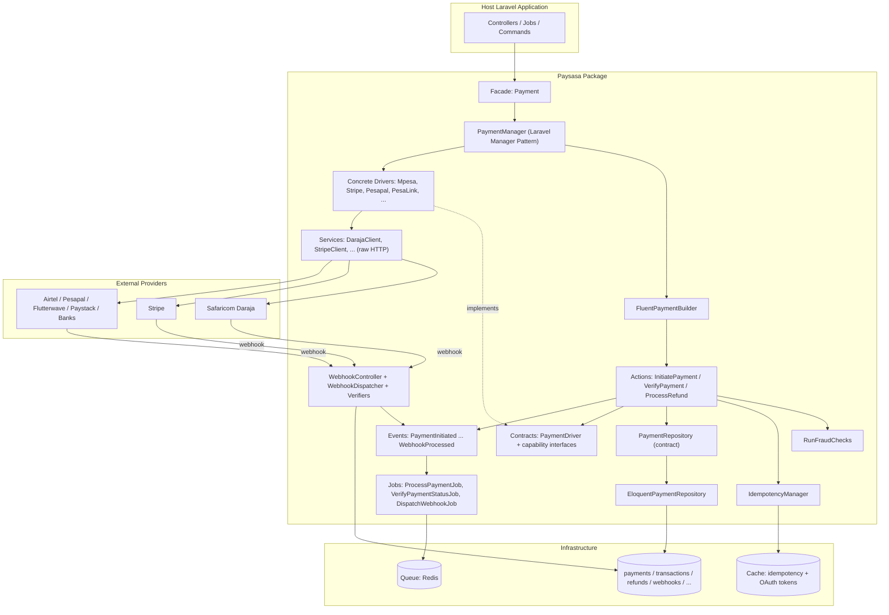

# Overview: High-Level Architecture & Package Structure

## 1. High-level system architecture

Paysasa is layered as Clean Architecture / DDD-lite, adapted to what a Laravel package actually needs (there is no value in a full hexagonal port/adapter ceremony here — the goal is testability and provider-swappability, not framework independence):



**Why this shape:** the host application only ever depends on the `Payment` facade and the `Contracts\*` interfaces. Everything below `Contracts` — drivers, HTTP clients, the Eloquent repository — is a replaceable implementation detail (Dependency Inversion). Swapping M-Pesa for Airtel Money, or the Eloquent repository for a different persistence backend, requires zero changes to `Action`, `Facade`, or application code.

## 2. Package directory structure

```
paysasa/
├── config/paysasa.php              # Publishable config: every provider, queue, security, logging setting
├── database/
│   ├── migrations/                 # 9 tables — see 05-database-schema.md
│   └── factories/                  # Model factories for package + host-app tests
├── routes/paysasa.php              # Webhook routes, registered by the service provider
├── src/
│   ├── PaysasaServiceProvider.php  # The single wiring point — see 04-architecture.md
│   ├── Contracts/                  # PaymentDriver + segregated capability interfaces (ISP)
│   ├── DTOs/                       # ChargeRequest, PaymentResponse, RefundRequest/Response, WebhookPayload, ...
│   ├── Enums/                      # PaymentStatus, PaymentProvider, Currency, TransactionType, ...
│   ├── Managers/                   # PaymentManager — Laravel Manager Pattern driver resolution
│   ├── Drivers/                    # Concrete provider implementations, grouped by category
│   │   ├── MobileMoney/            # MpesaDriver, AirtelMoneyDriver, TKashDriver
│   │   ├── Cards/                  # StripeDriver, PesapalDriver, FlutterwaveDriver, PaystackDriver
│   │   ├── Wallets/                # GooglePayDriver, ApplePayDriver (adapters, see 04-architecture.md)
│   │   └── Banking/                # AbstractBankingDriver, PesaLinkDriver, EftDriver, RtgsDriver, VirtualAccountDriver
│   ├── Services/                   # Raw-HTTP, provider-faithful clients (DarajaClient, StripeClient, ...) — no Paysasa DTOs here
│   ├── Actions/                    # Single-purpose orchestrators: InitiatePayment, VerifyPayment, ProcessRefund, RunFraudChecks
│   ├── Events/                     # 11 lifecycle events — see 04-architecture.md#event-lifecycle
│   ├── Listeners/                  # PaymentEventSubscriber — built-in payment_logs writer
│   ├── Jobs/                       # ProcessPaymentJob, VerifyPaymentStatusJob, DispatchWebhookJob
│   ├── Models/                     # Payment, Transaction, PaymentAttempt, Refund, Webhook, PaymentLog, ProviderAccount, PaymentMethod, AuditLog
│   ├── Exceptions/                 # PaymentException hierarchy — see 04-architecture.md#error-handling-strategy
│   ├── Middleware/                 # ThrottleWebhooks, EnsureIdempotencyKey
│   ├── Traits/                     # HasUuid, HasMinorUnitAmount
│   ├── Http/                       # Controllers/WebhookController, Requests/, Resources/ (API Resources)
│   ├── Webhooks/                   # WebhookDispatcher + Verifiers/ (one SignatureVerifier per provider — Strategy Pattern)
│   ├── Support/                    # FluentPaymentBuilder, IdempotencyManager, CredentialVault, EloquentPaymentRepository, PaymentLogger, AuditLogger
│   ├── Facades/Payment.php         # The Payment facade
│   ├── Console/Commands/           # paysasa:install, paysasa:status, paysasa:mpesa:register-urls
│   └── Testing/                    # PaymentFake, FakePaymentBuilder, FakeDriver — see 09-testing.md
├── tests/                          # Pest: Unit/ + Feature/
└── Documentation/                  # This folder
```

### Folder responsibilities, one line each

| Folder | Responsibility |
|---|---|
| `Contracts/` | The seams. Every cross-cutting behaviour (charge, refund, verify, webhook handling, signature verification) is an interface here before it's an implementation anywhere else. |
| `DTOs/` | Immutable, provider-agnostic value objects passed between layers — never an array, never a provider's raw response shape. |
| `Enums/` | Closed, provider-agnostic vocabularies (status, currency, provider, transaction type) — the single source of truth for "what states can a payment be in." |
| `Managers/` | Laravel Manager Pattern: resolves + caches driver instances from config, exactly like `Illuminate\Support\Manager` subclasses for Cache/Mail/Queue. |
| `Drivers/` | Adapter Pattern: translates the package's contracts into a specific provider's wire format, and that provider's responses back into the package's DTOs. |
| `Services/` | Thin, provider-faithful HTTP clients. Deliberately dumb — no business logic, no DTOs — so the wire format can change without touching driver logic. |
| `Actions/` | Single-purpose orchestrators (Command Pattern-ish) — the only place charge/refund/verify *sequencing* (fraud check → idempotency → persist → call driver → persist → event) is defined, so it's identical regardless of entry point. |
| `Events/` + `Listeners/` | Event-Driven Architecture — decouples "a payment succeeded" from "what happens next," which is the host application's decision, not the package's. |
| `Jobs/` | Queue-Based Processing — anything that shouldn't block a request/response cycle (webhook processing, delayed status verification). |
| `Models/` | Eloquent persistence — see `05-database-schema.md`. |
| `Exceptions/` | A typed hierarchy so callers can catch precisely (`ProviderApiException` vs `WebhookVerificationException`) instead of parsing message strings. |
| `Middleware/` | HTTP-layer guards: webhook rate limiting, idempotency-key enforcement on a host app's own API. |
| `Http/` | Controllers, Form Requests, API Resources — the HTTP boundary, kept thin (delegates to `Actions/` and `Webhooks/`). |
| `Webhooks/` | Strategy Pattern registry of per-provider signature verification, plus the dispatcher that picks the right one. |
| `Support/` | Everything that doesn't fit a more specific bucket but is shared infrastructure: the fluent builder, idempotency, credential resolution, logging. |
| `Facades/` | The one class application code is meant to import. |
| `Console/Commands/` | Operational tooling: install, health-check every configured driver, one-time provider setup (Daraja URL registration). |
| `Testing/` | `Payment::fake()` and friends — see `09-testing.md`. |

## Design principles applied

- **SOLID** — Single Responsibility (one action per orchestration step), Open/Closed (new drivers via `extend()`, no core edits), Liskov (every driver is substitutable wherever `PaymentDriver` is type-hinted), Interface Segregation (`Refundable`, `PayoutCapable`, `BalanceInquirable`... are separate interfaces, not one bloated contract), Dependency Inversion (`Actions/` depend on `Contracts/`, never on concrete drivers).
- **DDD-lite** — `DTOs/` and `Enums/` model the payments domain independent of any provider's vocabulary; `Models/` is the persistence layer, kept behind `Contracts\PaymentRepository` so the domain doesn't leak Eloquent specifics into `Actions/`.
- **Repository Pattern** — `Contracts\PaymentRepository` / `Support\EloquentPaymentRepository`.
- **Strategy Pattern** — `Contracts\SignatureVerifier` + `Webhooks/Verifiers/*`.
- **Factory / Manager Pattern** — `Managers\PaymentManager` (mirrors `Illuminate\Support\Manager`).
- **Adapter Pattern** — every class in `Drivers/`.
- **Dependency Injection / Service Container** — every class is constructor-injected and resolved via the container; nothing does `new SomeDriver()` internally.
