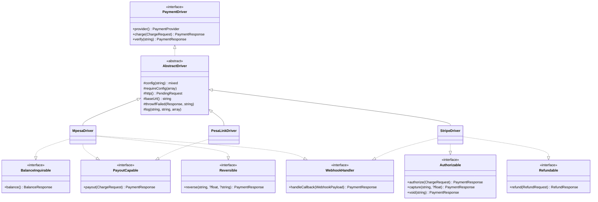
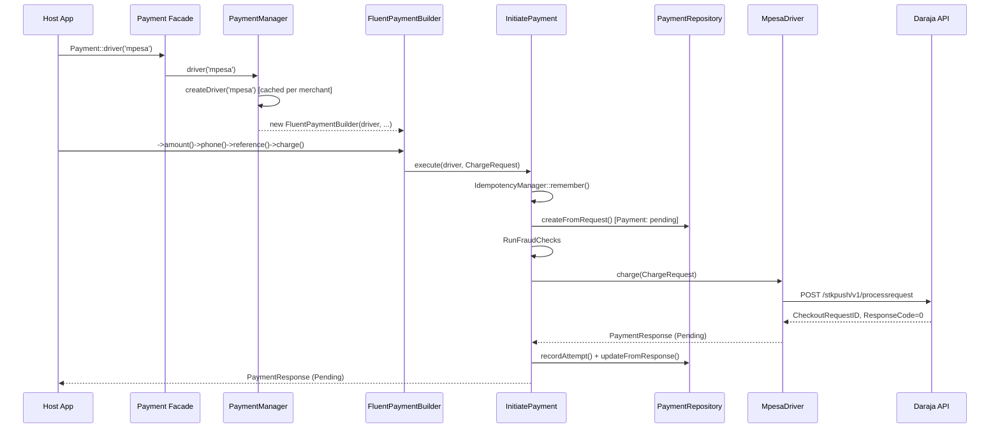
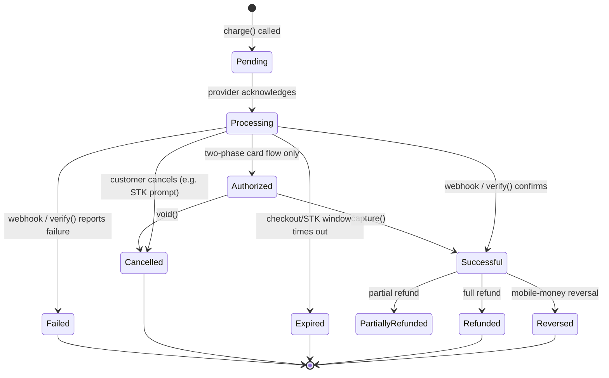
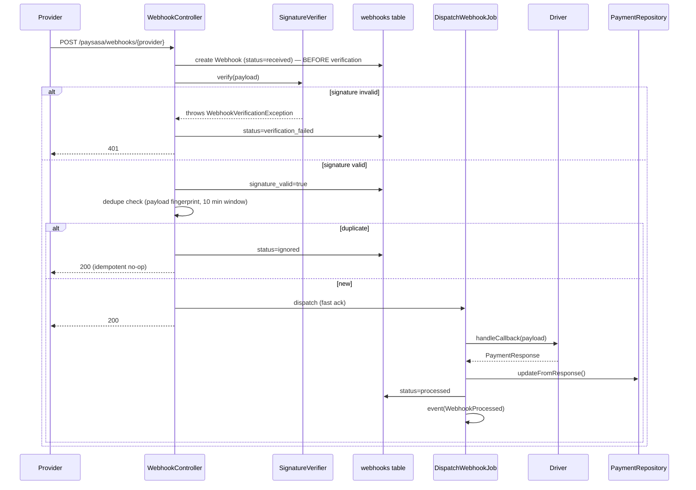
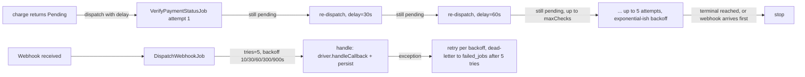
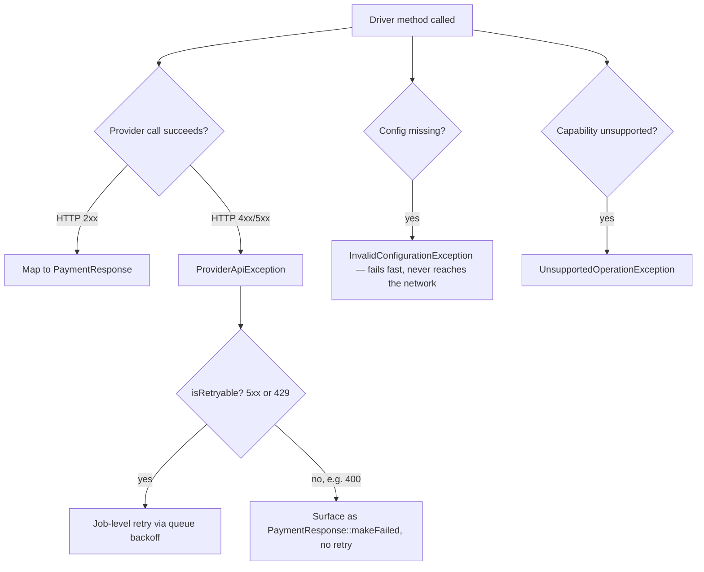

# Architecture

This document covers deliverables 3–14 of the technical blueprint: contracts, service layer, driver architecture, class diagrams, and every lifecycle (transaction, webhook, event, queue), plus authentication flow and error handling strategy.

## Contracts and interfaces



**Why capability interfaces are segregated** (Interface Segregation Principle): `PaymentDriver` itself only requires `charge()` and `verify()` — the two operations every provider supports. Everything else (`refund()`, `payout()`, `balance()`...) is its own interface, implemented only by drivers whose provider actually offers it. Code that needs a refund type-checks `instanceof Refundable` rather than calling a method that would throw `UnsupportedOperationException` on half the drivers.

## Service layer design

`Actions/` holds the only orchestration logic in the package:

- **`InitiatePayment`** — fraud checks → idempotency wrap → persist `Payment` (status `pending`) → call `$driver->charge()` → persist attempt + transaction → update payment → fire the appropriate terminal event (only if the driver returned a terminal status synchronously; async providers fire it later from the webhook path).
- **`VerifyPayment`** — re-queries a still-pending payment's provider, updates persistence, fires the terminal event if the status changed. Used by `VerifyPaymentStatusJob`.
- **`ProcessRefund`** — persists a `Refund` row, calls `$driver->refund()`, updates the payment's status (`refunded` vs `partially_refunded`), fires `PaymentRefunded`, writes an audit log entry.
- **`RunFraudChecks`** — resolves and runs every class in `config('paysasa.fraud_checks')`.

Every one of these is a plain, single-method-entrypoint class — no shared base class, no inheritance hierarchy — because they don't share behaviour, only a place in the sequence.

## Driver architecture



`PaymentManager::createDriver()` resolves the concrete class from `config('paysasa.drivers.{name}.driver')` through the container, injecting `(array $config, PaymentLogger $logger)` — every driver constructor signature is identical, which is what makes `extend()` trivial for third-party drivers (see [`06-driver-development-guide.md`](06-driver-development-guide.md)).

## Transaction lifecycle



`PaymentStatus::isTerminal()` defines exactly which of these are terminal — `Pending`, `Processing`, and `Authorized` are not; everything else is.

## Webhook lifecycle



Persisting the raw payload **before** verification is deliberate: a failed-verification row is forensic evidence of a spoofing attempt, not noise to discard. See [`07-webhook-guide.md`](07-webhook-guide.md) for the signature scheme used by each provider.

## Event lifecycle

| Event | Fires when | Broadcasts? |
|---|---|---|
| `PaymentInitiated` | A `Payment` row is created, before any provider call | No |
| `PaymentProcessing` | Immediately before the provider API call | No |
| `PaymentAuthorized` | A two-phase card authorize() holds funds without capturing | No |
| `PaymentSuccessful` | Status reaches `Successful` (sync charge or async webhook/verify) | Yes — private channel `paysasa.payments.{uuid}` |
| `PaymentFailed` | Status reaches `Failed`, or an exception aborted the charge | Yes |
| `PaymentCancelled` | Payer explicitly cancels (e.g. dismisses the STK prompt) | No |
| `PaymentExpired` | A checkout link / STK prompt times out unanswered | No |
| `PaymentRefunded` | `ProcessRefund` completes successfully | No |
| `PaymentReversed` | A mobile-money reversal completes | No |
| `WebhookReceived` | Immediately after signature verification succeeds | No |
| `WebhookProcessed` | After the driver has translated the webhook and persistence is updated | No |

Listen the normal Laravel way:

```php
// EventServiceProvider
protected $listen = [
    \Paysasa\Payments\Events\PaymentSuccessful::class => [
        \App\Listeners\MarkInvoicePaid::class,
        \App\Listeners\SendReceiptEmail::class,
    ],
];
```

or inline (`Event::listen(...)`), or via a broadcast listener on the frontend (`Echo.private('paysasa.payments.' + uuid).listen('.payment.successful', ...)`) for a live "payment received" UI update while the customer is still looking at the STK prompt.

The package's own `Listeners\PaymentEventSubscriber` also runs on every one of these, writing to `payment_logs` — your listeners run *in addition to*, not instead of, that.

## Queue workflow



`config('paysasa.queue.backoff')` (`[10, 30, 60, 300, 900]`) governs both job types. Standard Laravel `failed_jobs` handling applies once retries are exhausted — nothing package-specific to configure beyond `queue.tries` / `retryUntil()`; inspect and retry with `php artisan queue:failed` / `queue:retry` as usual.

## Authentication flow (outbound, to providers)

Three patterns, depending on provider:

1. **OAuth2 client-credentials, cached** (Daraja, Airtel, Pesapal) — `Services\*\*Authenticator implements Contracts\TokenProvider`, caches the bearer token for slightly less than its real TTL (e.g. Daraja: cached 3500s of a 3599s token) so a near-expiry token is never handed to an in-flight request.
2. **Static bearer secret key** (Stripe, Flutterwave, Paystack) — no token exchange; the secret key itself is the credential, sent as `Authorization: Bearer`.
3. **API key + bank-specific scheme** (banking rails) — via `AbstractBankingDriver`, overridden per bank.

## Error handling strategy



Every exception extends `Exceptions\PaymentException` and carries structured `context()` — catch the base class for uniform handling, or a specific subclass (`ProviderApiException`, `WebhookVerificationException`, `IdempotencyConflictException`, `InsufficientFundsException`, `FraudSuspectedException`) for targeted recovery. `InitiatePayment` catches `ProviderApiException` and `FraudSuspectedException` specifically and converts them into a `Failed` `PaymentResponse` plus a `PaymentFailed` event — application code calling `->charge()` sees a response object, not an exception, for the normal "the payment failed" case; exceptions are reserved for genuinely exceptional conditions (misconfiguration, unsupported operations).

## Wallets are adapters, not rails

`GooglePayDriver` and `ApplePayDriver` are the one deliberate architectural simplification worth calling out: **neither Google Pay nor Apple Pay is an independent settlement network in Kenya (or anywhere).** Both are wallet/tokenization layers sitting on top of the existing card networks — the browser or device hands your frontend an encrypted payment token, your frontend SDK (Stripe.js, etc.) exchanges it for a processor token, and *that* token is what reaches this backend. Consequently:

```php
class GooglePayDriver extends AbstractDriver implements Refundable
{
    public function charge(ChargeRequest $request): PaymentResponse
    {
        return $this->gateway()->charge($request); // delegates to config('paysasa.drivers.google_pay.gateway'), default stripe
    }
}
```

This is intentional, not a shortcut — modeling Google Pay/Apple Pay as if they had their own settlement API would misrepresent how card-network tokenization actually works, and would leave you unable to explain to a PCI auditor where money actually moved.

## Multi-merchant credential resolution

```mermaid
flowchart LR
    A["Payment::forMerchant(id)->driver('mpesa')"] --> B[PaymentManager::createDriver]
    B --> C[CredentialVault::resolve]
    C --> D{Active provider_accounts row for merchant+provider?}
    D -->|yes| E[merge: config defaults + decrypted credentials + settings]
    D -->|no| F[config('paysasa.drivers.mpesa') only]
    E --> G[Driver instantiated with resolved config]
    F --> G
```

`provider_accounts.credentials` is stored via Laravel's `AsEncryptedCollection` cast — encrypted at rest with `APP_KEY`, decrypted only in-process, never logged (see [`08-security.md`](08-security.md)).
