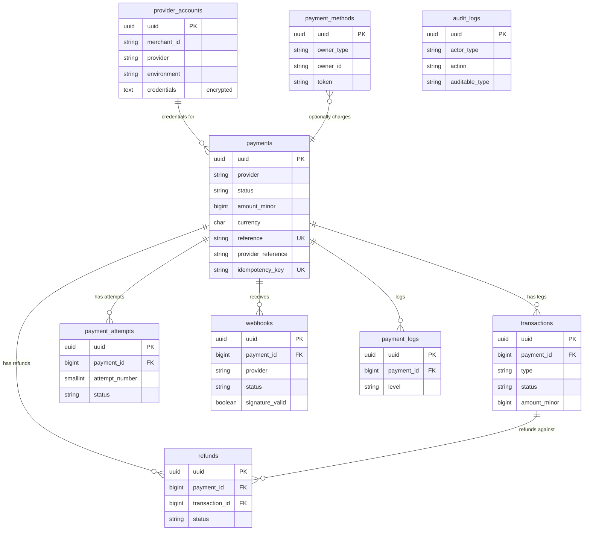

# Database Schema

Every table listed in the original brief is implemented. Full column rationale lives as doc-comments directly on each migration in `database/migrations/` (the source of truth) — this document summarizes the *why* behind the shape.

## Design decisions that apply across every table

- **UUID + auto-increment id, both.** The auto-increment `id` is the internal FK target (fast joins); `uuid` is the only identifier ever exposed externally (API responses, route model binding via `HasUuid::getRouteKeyName()`). Never leak sequential IDs that reveal transaction volume to competitors.
- **Amounts stored in minor units (`amount_minor`, integer).** Floating-point currency arithmetic is a correctness bug waiting to happen; `Traits\HasMinorUnitAmount` exposes a virtual `amount` accessor/mutator so application code still works in major units (2500.00) without ever doing float math on the stored value. `Enums\Currency::minorUnitExponent()` handles zero-decimal currencies (e.g. RWF) correctly.
- **No hard foreign keys to the host application's tables** (`customer_id`, `merchant_id`, `initiated_by`, `actor_id`...). The package doesn't know or care what the host app's user/tenant model looks like — string columns + indexes, not `constrained()`, keep the package installable into any schema.
- **Soft deletes** on `payments`, `provider_accounts`, `payment_methods` — financial records are never hard-deleted; "delete" means "no longer active," preserving the audit trail.
- **JSON `metadata`/`settings`/`payload` columns** — every table that needs to carry caller-supplied or provider-supplied structured data uses a JSON column rather than an EAV pattern, since Postgres/MySQL 8 JSON querying is more than sufficient for the access patterns here (find-by-payment, not analytics-scale querying — export to a warehouse for that).

## Table summaries

| Table | Purpose | Distinguishing design point |
|---|---|---|
| `payments` | One row per logical payment intent. The canonical/summary record. | `status` is the current summary state; `transactions` is the detailed ledger underneath it. |
| `transactions` | One row per provider API leg (charge, capture, payout, reversal). | A single payment can have many legs — e.g. authorize + capture, or a split payment's multiple payout legs. |
| `payment_attempts` | One row per *attempt* to charge, including ones the provider never acknowledged (timeout, customer cancel). | Distinct from `transactions`: this table exists even for attempts that produced no provider-side record, and drives retry/velocity logic. |
| `refunds` | One row per refund request, partial or full. | Links to both `payments` and, optionally, the specific `transactions` leg being refunded. |
| `webhooks` | Immutable log of every inbound webhook, including signature-verification failures. | `(provider, provider_event_id)` unique constraint is the primary dedupe key when a provider supplies one. |
| `payment_logs` | Queryable structured log ("everything that happened for payment X"), separate from Laravel's log files. | `INSERT`-only (`UPDATED_AT = null`) — logs are never edited. |
| `provider_accounts` | Per-merchant credential/config overrides for Multi-Merchant support. | `credentials` is `AsEncryptedCollection` — encrypted at rest, decrypted only in-process. |
| `payment_methods` | Saved/tokenized payment methods (card-on-file, saved mobile money number). | Stores only the provider's vault token — **never** a raw PAN/CVV, which is what keeps the host app out of PCI SAQ D scope. |
| `audit_logs` | Who did what to which sensitive record (refund approvals, credential rotation). | Append-only at the application layer; distinct from `payment_logs`, which is system/API activity rather than human actions. |

See `database/migrations/*.php` for every column, its type, and an inline comment explaining its purpose — that's the authoritative reference, kept in sync with the schema by construction (docs that live next to code don't drift the way a separate schema doc does).
